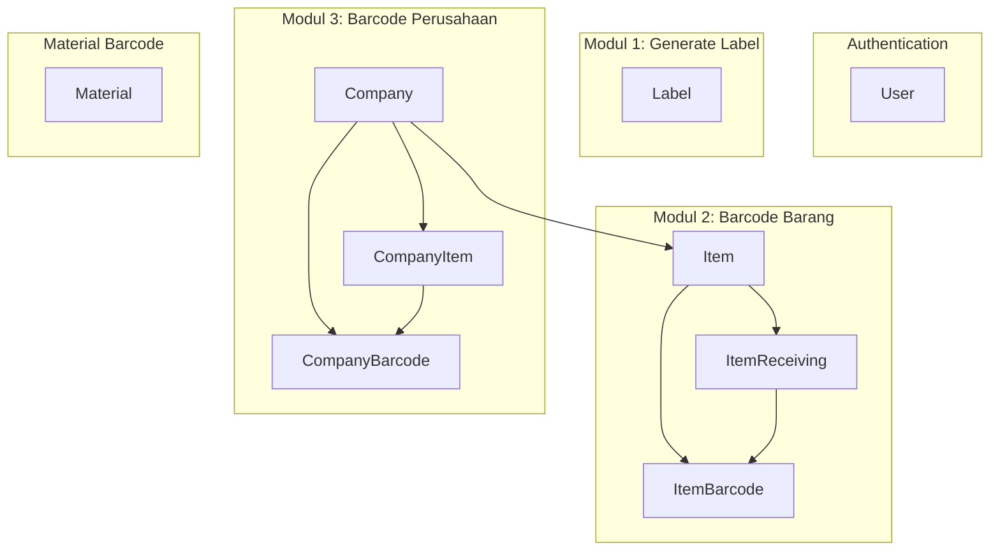

# Barcode Web App Implementation Plan

## Current State

- **Laravel 10** project with default setup ([composer.json](composer.json))
- **Vite 5** configured ([vite.config.js](vite.config.js), [package.json](package.json))
- **Breeze not installed** (auth routes referenced in welcome.blade.php but no routes exist)
- **No ERD.md, TODO.md, first.sh** exist
- **Flowchart** in [barcode01.drawio](barcode01.drawio) defines 3 modules with data flow

---

## Architecture Overview

---

## Phase 1: Documentation and Design

### 1.1 Create ERD.md

Design database schema with these tables:

| Table              | Purpose                                                                                                                                        |
| ------------------ | ---------------------------------------------------------------------------------------------------------------------------------------------- |
| `users`            | Breeze auth (existing)                                                                                                                         |
| `companies`        | Perusahaan - name, etc.                                                                                                                        |
| `items`            | Barang - customer, part_name, part_number, model, berat, qty, inspector_name, tgl_produksi, tgl_expired, code, posisi_rak, tingkat, company_id |
| `labels`           | Modul 1 - simple label data (customer, part_name, etc.) for print                                                                              |
| `item_receivings`  | Barang masuk - transfer_slip_no, tanggal_terima_fg, jumlah_box, item_id                                                                        |
| `item_barcodes`    | Barcode 1 - links item + receiving, stores barcode_id for scan lookup                                                                          |
| `company_items`    | Pivot for company barcode - company_id, item_id, qty, posisi_rak, tingkat                                                                      |
| `company_barcodes` | Barcode 2 - company snapshot for scan                                                                                                          |
| `materials`        | Material barcode - ukuran_material, jenis_bahan (SPCC/SESE), quantity, no_surat_jalan, tanggal_terima                                          |

### 1.2 Create TODO.md

Detailed task breakdown with checkboxes for each phase and sub-task.

---

## Phase 2: Package Installation

### 2.1 Backend (Composer)

- `laravel/breeze` - API or Blade stack (Blade recommended for Vite + Blade views)
- `picqer/php-barcode-generator` or `milon/barcode` - for generating barcode images

### 2.2 Frontend (NPM)

- `html5-qrcode` or `@zxing/library` - for barcode scanning in browser
- `tailwindcss` - Breeze adds this; if not using Breeze, add Tailwind CSS
- `@tailwindcss/forms` - form styling

---

## Phase 3: Shell Script (first.sh)

Create [first.sh](first.sh) with `php artisan make:` commands to generate:

- **Migrations**: `companies`, `items`, `labels`, `item_receivings`, `item_barcodes`, `company_items`, `company_barcodes`, `materials`
- **Models**: Company, Item, Label, ItemReceiving, ItemBarcode, CompanyItem, CompanyBarcode, Material
- **Seeders**: DatabaseSeeder (updated), CompanySeeder, ItemSeeder, etc.
- **Controllers**: LabelController, ItemBarcodeController, CompanyBarcodeController, MaterialController, ScanController (for scan lookup)

Script should be executable (`chmod +x first.sh`) and runnable via `./first.sh`.

---

## Phase 4: Database Migrations

### 4.1 Migration Files

Create migrations in order:

1. `create_companies_table` - id, name, timestamps
2. `create_items_table` - company_id, customer, part_name, part_number, model, berat, qty, inspector_name, tgl_produksi, tgl_expired, code, posisi_rak, tingkat
3. `create_labels_table` - same fields as Modul 1 form (for print history)
4. `create_item_receivings_table` - item_id, transfer_slip_no, tanggal_terima_fg, jumlah_box
5. `create_item_barcodes_table` - item_id, item_receiving_id, barcode_id (unique for scan lookup)
6. `create_company_items_table` - company_id, item_id, qty, posisi_rak, tingkat
7. `create_company_barcodes_table` - company_id, barcode_id (unique)
8. `create_materials_table` - ukuran_material, jenis_bahan (enum SPCC/SESE), quantity, no_surat_jalan, tanggal_terima

---

## Phase 5: Models and Seeders

### 5.1 Eloquent Models

- `Company` hasMany `Item`, hasMany `CompanyBarcode`
- `Item` belongsTo `Company`, hasMany `ItemReceiving`, hasMany `ItemBarcode`
- `ItemReceiving` belongsTo `Item`
- `ItemBarcode` belongsTo `Item`, belongsTo `ItemReceiving`
- `CompanyBarcode` belongsTo `Company`
- `CompanyItem` belongsTo `Company`, belongsTo `Item`
- `Material` - standalone

### 5.2 Seeders

- `CompanySeeder` - 2-3 sample companies
- `ItemSeeder` - sample items per company
- `LabelSeeder` - sample labels
- `ItemReceivingSeeder` - sample receiving records
- `MaterialSeeder` - sample materials

---

## Phase 6: Controllers

Controllers with RESTful or resource methods:

| Controller                 | Methods                                                 | Purpose                                                                |
| -------------------------- | ------------------------------------------------------- | ---------------------------------------------------------------------- |
| `LabelController`          | index, create, store, show, print                       | Modul 1                                                                |
| `ItemBarcodeController`    | index, create (2A), storeReceiving (2B), generate, scan | Modul 2                                                                |
| `CompanyBarcodeController` | index, create, store, generate, scan                    | Modul 3                                                                |
| `MaterialController`       | index, create, store, generate                          | Material barcode                                                       |
| `ScanController`           | show (scan)                                             | Unified scan endpoint - decode barcode_id, return item or company data |

---

## Phase 7: Routes and Middleware

- `web.php` - protected routes under `auth` middleware
- `/` - redirect to dashboard or login
- `/dashboard` - main menu (3 module cards)
- `/labels/*` - Modul 1
- `/item-barcodes/*` - Modul 2
- `/company-barcodes/*` - Modul 3
- `/materials/*` - Material
- `/scan` - scan page (camera + input)
- `/scan/{barcode_id}` - API/lookup for scan result

---

## Phase 8: Views (Vite + Blade)

### 8.1 Layout

- `resources/views/layouts/app.blade.php` - main layout with nav, `@vite` directive
- `resources/views/dashboard.blade.php` - menu utama with 3 module cards + Material

### 8.2 Modul 1 Views

- `labels/create.blade.php` - form with all label fields
- `labels/preview.blade.php` - preview with barcode + label, print button
- `labels/index.blade.php` - list of generated labels

### 8.3 Modul 2 Views

- `item-barcodes/create.blade.php` - form 2A (item info + posisi rak) + form 2B (receiving)
- `item-barcodes/show.blade.php` - generated barcode 1 preview
- `item-barcodes/index.blade.php` - list

### 8.4 Modul 3 Views

- `company-barcodes/create.blade.php` - form with company + items (multi-select or dynamic rows)
- `company-barcodes/show.blade.php` - generated barcode 2 preview
- `company-barcodes/index.blade.php` - list

### 8.5 Material Views

- `materials/create.blade.php` - form (ukuran, jenis SPCC/SESE, qty, no surat jalan, tanggal)
- `materials/show.blade.php` - barcode + label preview

### 8.6 Scan View

- `scan/index.blade.php` - camera scanner (html5-qrcode) + manual input, display result

### 8.7 Vite/JS

- `resources/js/app.js` - bootstrap
- `resources/js/scan.js` - scan logic (optional separate entry)
- `resources/css/app.css` - Tailwind directives (from Breeze)

---

## Phase 9: Barcode Generation and Scanning

### 9.1 Backend Barcode Generation

- Use `picqer/php-barcode-generator` to generate PNG/SVG
- Encode unique ID (e.g., `IB-{id}` for item, `CB-{id}` for company) in barcode
- Store mapping in DB for scan lookup

### 9.2 Frontend Scanning

- Use `html5-qrcode` for camera-based scanning
- On scan: decode value, call `/scan/{barcode_id}` or API, display result in modal/panel

---

## Key Files to Create/Modify

| File                                            | Action                      |
| ----------------------------------------------- | --------------------------- |
| [ERD.md](ERD.md)                                | Create                      |
| [TODO.md](TODO.md)                              | Create                      |
| [first.sh](first.sh)                            | Create                      |
| [database/migrations/*](database/migrations/)   | Create 8 new migrations     |
| [database/seeders/*](database/seeders/)         | Create/update seeders       |
| [app/Models/*](app/Models/)                     | Create 8 models             |
| [app/Http/Controllers/*](app/Http/Controllers/) | Create 5 controllers        |
| [routes/web.php](routes/web.php)                | Add routes                  |
| [resources/views/**](resources/views/)          | Create layout + ~15 views   |
| [resources/js/app.js](resources/js/app.js)      | Extend if needed            |
| [composer.json](composer.json)                  | Add breeze, barcode package |
| [package.json](package.json)                    | Add scan library, tailwind  |

---

## Execution Order

1. ERD.md, TODO.md
2. first.sh (generate skeleton files)
3. Install Breeze + barcode package
4. Run migrations (after writing migration code)
5. Write migration code in generated files
6. Write model code
7. Write seeder code
8. Write controller code
9. Configure routes
10. Create views
11. Test flow

---

## Clarifications Needed

- **Breeze stack**: Blade + Livewire, Blade + Inertia (Vue/React), or API + SPA? The prompt says "Vitejs" for frontend; Blade + Vite is the simplest fit.
- **Material barcode**: Is this a 4th module in the main menu, or part of another flow?
- **Print**: Browser print (`window.print()`) or server-side PDF generation?

