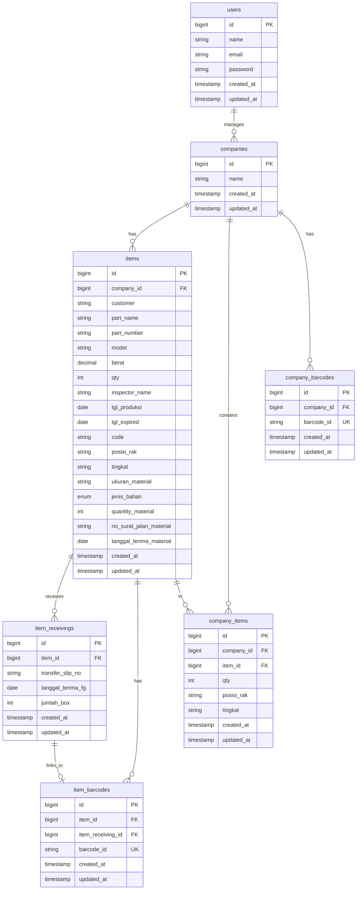

# Entity Relationship Diagram - Barcode Web App

## Overview

Aplikasi web untuk generate dan scan barcode barang dan perusahaan. Hanya 2 jenis barcode: **Barcode Barang** dan **Barcode Perusahaan**.

---

## Entity Relationship Diagram

---

## Table Definitions

### users (Breeze - existing)
| Column | Type | Notes |
|--------|------|-------|
| id | bigint | PK |
| name | string | |
| email | string | unique |
| password | string | |
| created_at | timestamp | |
| updated_at | timestamp | |

### companies
| Column | Type | Notes |
|--------|------|-------|
| id | bigint | PK |
| name | string | Nama perusahaan |
| created_at | timestamp | |
| updated_at | timestamp | |

### items
| Column | Type | Notes |
|--------|------|-------|
| id | bigint | PK |
| company_id | bigint | FK → companies |
| customer | string | |
| part_name | string | |
| part_number | string | |
| model | string | |
| berat | decimal | |
| qty | int | |
| inspector_name | string | |
| tgl_produksi | date | Tanggal produksi |
| tgl_expired | date | Tanggal expired |
| code | string | Kode unik/label untuk barcode |
| posisi_rak | string | |
| tingkat | string | |
| ukuran_material | string | Material |
| jenis_bahan | enum | SPCC, SESE |
| quantity_material | int | Material |
| no_surat_jalan_material | string | Material |
| tanggal_terima_material | date | Material |
| created_at | timestamp | |
| updated_at | timestamp | |

### item_receivings
| Column | Type | Notes |
|--------|------|-------|
| id | bigint | PK |
| item_id | bigint | FK → items |
| transfer_slip_no | string | Nomor transfer slip |
| tanggal_terima_fg | date | Tanggal terima barang FG ke gudang |
| jumlah_box | int | |
| created_at | timestamp | |
| updated_at | timestamp | |

### item_barcodes
| Column | Type | Notes |
|--------|------|-------|
| id | bigint | PK |
| item_id | bigint | FK → items |
| item_receiving_id | bigint | FK → item_receivings |
| barcode_id | string | Unique - untuk scan lookup (IB-{id}) |
| created_at | timestamp | |
| updated_at | timestamp | |

### company_items (pivot)
| Column | Type | Notes |
|--------|------|-------|
| id | bigint | PK |
| company_id | bigint | FK → companies |
| item_id | bigint | FK → items |
| qty | int | |
| posisi_rak | string | |
| tingkat | string | |
| created_at | timestamp | |
| updated_at | timestamp | |

### company_barcodes
| Column | Type | Notes |
|--------|------|-------|
| id | bigint | PK |
| company_id | bigint | FK → companies |
| barcode_id | string | Unique - untuk scan lookup (CB-{id}) |
| created_at | timestamp | |
| updated_at | timestamp | |

---

## Relationships

- **Company** has many **Items**
- **Item** belongs to **Company**, has many **ItemReceivings**, has many **ItemBarcodes**
- **ItemReceiving** belongs to **Item**
- **ItemBarcode** belongs to **Item** and **ItemReceiving**
- **Company** has many **CompanyItems** (pivot), has many **CompanyBarcodes**
- **CompanyItem** belongs to **Company** and **Item**
